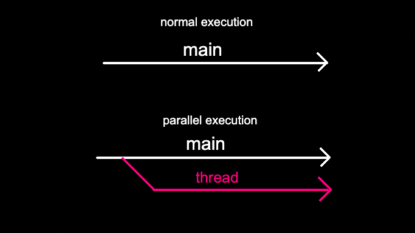

# La cena dei filosofi


Se anche tu non hai mai sentito parlare della cena dei filosofi, ti suggerisco di leggere la [relativa pagina di Wikipedia](https://it.wikipedia.org/wiki/Problema_dei_filosofi_a_cena).

## Parte Mandatoria

La differenza tra il problema in se è l'obiettivo del progetto è la presenza dei limiti di tempo: infatti i filosofi non possono stare troppo tempo senza mangiare, e al contempo l'azione del mangiare e del dormire richiedono del tempo. Questi dati vengono immessi come argomenti del programma, dunque vanno controllati.

La parte obbligatoria stabilisce che è essenziale che ogni filosofo sia un thread. In altre parole, il thread è una parte di codice che viene eseguita in contemporanea (o in parallelo), anche se nella realtà, i thread non vengono eseguiti in contemporanea, ma viene eseguita una parte di codice di ognuno di essi alla volta.

[breve introduzione ai thread(in inglese)](https://code-vault.net/course/6q6s9eerd0:1609007479575/lesson/18ec1942c2da46840693efe9b51d86a8)



Questo nuovo oggetto genera un problema non indifferente: infatti, dato che i thread lavorano spesso sulle stesse variabili, potrebbe capitare che un thread acceda e modifichi il valore di una variabile in maniera impropria, andando a creare ciò che viene definito il [race condition](https://code-vault.net/course/6q6s9eerd0:1609007479575/lesson/18ec1942c2da46840693efe9b51ea1a2). In nostro supporto vengono le mutex, delle variabili che bloccano l'utilizzo di una determinata variabile quando essa viene utilizzata da un thread.

[utilizzo delle mutexes](https://code-vault.net/course/6q6s9eerd0:1609007479575/lesson/18ec1942c2da46840693efe9b51eabf6)

## Parte Bonus

Nella parte bonus, i filosofi devono essere processi, ovvero come dei programmi a se stanti che non si parlano tra loro. Ecco che la mutex non ci è più d'aiuto, ma esistono i semafori, che similmente bloccano l'esecuzione di un processo se non è possibile accedervi, ma è da immaginare più come un contenitore che se è pieno, da la possibilità ad un processo di eseguire il codice, altrimenti no.

[introduzione ai semafori](https://code-vault.net/course/6q6s9eerd0:1609007479575/lesson/v9l3sqtpft:1609091934815)

## Alcuni consigli
- non è possibile utilizzare la funzione `exit()` nella parte obbligatoria;
- la funzione `usleep()` è obsolete da Manuale, quindi sarà tua premura implementare una funzione che effettivamente aspetti che trascorra il tempo necessario per il compimento di un'azione.
```
void	ft_usleep(long int time_in_ms)
{
	long int	start_time;

	start_time = 0;
	start_time = actual_time();
	while ((actual_time() - start_time) < time_in_ms)
		usleep(time_in_ms / 10);
}
```
- anche la funzione `gettimeoftheday()` deve essere implementata così che ritorni il tempo in millisecondi:
```
int	get_time(void)
{
	static struct timeval	tv;

	gettimeofday(&tv, NULL);
	return ((tv.tv_sec * (uint64_t)1000) + (tv.tv_usec / 1000));
}
```

## Casi per test
Molto importante controllare che il programma non lasci memoria allocata anteponendo al esecuzione del programma e dei suoi parametri `leaks -atExit --` oppure controllando dall'applicazione Monitoraggio Attivià (Activity Monitor)

| dati in ingresso | risultato aspettato Output |
|:----------|:-------|
| 1 200 200 200 | il filososo 1 deve prendere una forketta e morire dopo 210 ms |
| 2 800 200 200 | nessuno deve morire |
| 5 800 200 200 | nessuno deve morire |
| 5 800 200 200 7 | la simulazione deve fermarsi quando tutti i filosofi hanno mangiato 7 volte |
| 5 500 200 200 7 | un filosofo deve morire prima che si fermi la simulazione |
| 4 410 200 200 | nessuno deve morire |
| 4 310 200 200 | un filosofo deve morire |
| 4 500 200 1.2 | paramentri non validi |
| 4 0 200 200 | paramentri non validi |
| 4 -500 200 200 | paramentri non validi |
| 4 500 200 2147483647 | un filosofo deve morire dopo 510 ms |
| 4 2147483647 200 200 | nessuno deve morire |
| 4 214748364732 200 200 | paramentri non validi |
| 4 200 210 200 | un filosofo deve morire e il messaggio apparire dopo 210 ms |
